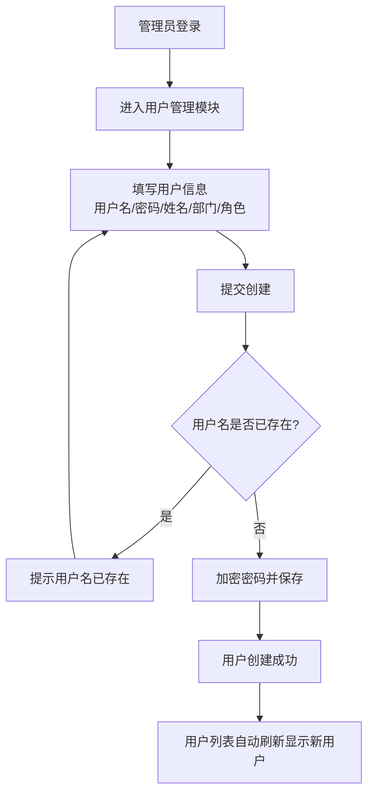
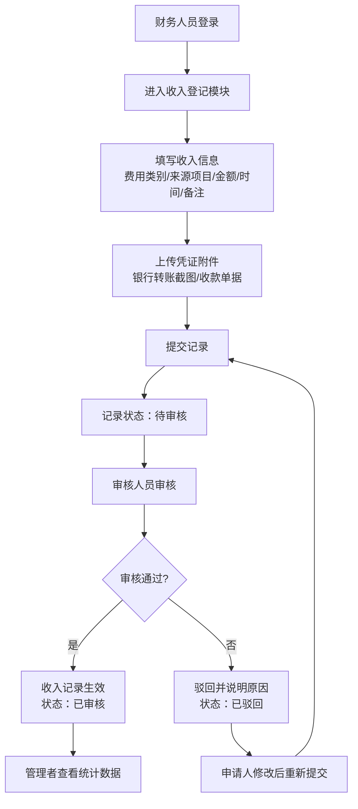
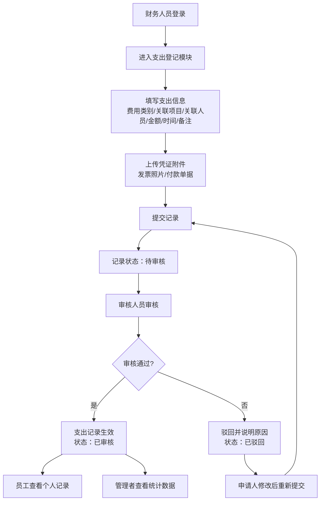
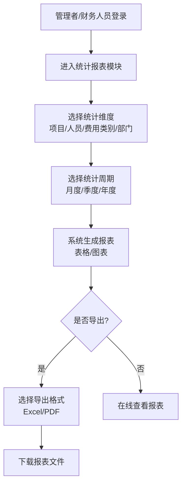
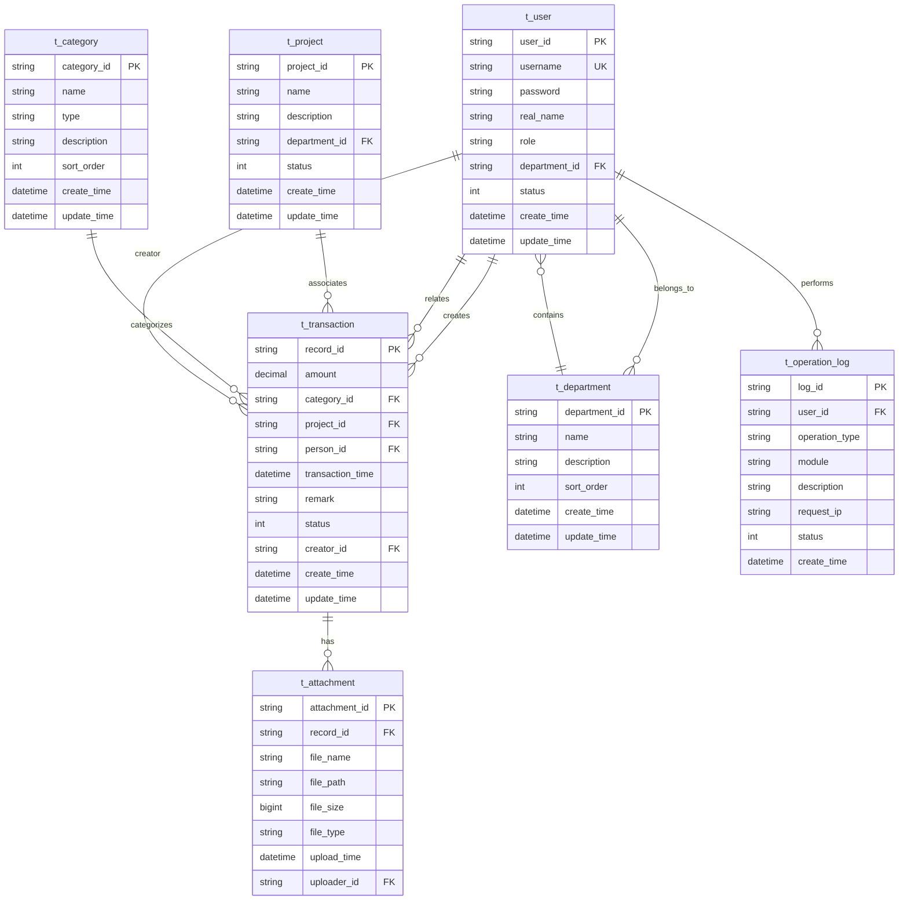

# 账务管理系统需求规格说明书（SRS）

---

## 文档信息

| 项目 | 内容 |
|------|------|
| 文档版本 | v2.1 |
| 编写日期 | 2026年2月23日 |
| 作者 | V5General |
| 项目名称 | 账务管理系统 |
| 项目类型 | Web应用系统 |
| 技术栈 | Go + Vue 3 + MySQL |

---

## 目录

1. [背景](#1-背景)
2. [项目愿景](#2-项目愿景)
3. [用户角色](#3-用户角色)
4. [主要业务流程](#4-主要业务流程)
5. [数据](#5-数据)
6. [外部接口](#6-外部接口)
7. [功能](#7-功能)
8. [性能](#8-性能)
9. [开发](#9-开发)
10. [希望的输出成果](#10-希望的输出成果)

---

## 1. 背景

### 1.1 前因

传统财务管理方式存在诸多问题：
- 手工记录效率低下，易出现录入错误和数据丢失
- 收支流水分散，难以进行统一管理和统计分析
- 凭证附件纸质存储，检索困难且易损坏
- 权限管理不清晰，数据安全存在隐患
- 多维度统计报表制作繁琐，决策支持能力弱

### 1.2 后果

为解决上述问题，需要开发一套轻量化、易操作、权限清晰的BS架构账务管理系统，实现：
- 收支流水的规范化记录和统一管理
- 凭证附件的数字化存储和便捷检索
- 基于角色的多级权限控制
- 多维度数据统计分析和可视化报表
- 部门和项目的精细化管理

### 1.3 项目范围

| 阶段 | 范围 |
|------|------|
| MVP（当前） | 用户管理、部门管理、收支登记、分类管理、项目管理、凭证附件、基础统计 |
| 长期 | 高级数据分析、预算管理、报销审批流程、移动端适配 |

---

## 2. 项目愿景

### 2.1 目标

构建一套适合中小企业使用的轻量化账务管理系统，实现收支流水的规范化记录、凭证的统一管理及多维度数据统计分析，提升财务管理效率。

### 2.2 解决的问题

1. **记录规范化**：统一收支记录格式，规范录入流程
2. **凭证数字化**：将纸质凭证转换为电子附件，便于存储和检索
3. **权限清晰化**：基于角色的权限控制，确保数据安全
4. **统计自动化**：自动生成多维度统计报表，辅助决策
5. **管理精细化**：支持部门和项目的分类管理

---

## 3. 用户角色

### 3.1 角色定义

| 角色 | 代码标识 | 核心职责 | 主要操作权限 |
|------|----------|----------|--------------|
| **管理员** | ADMIN | 系统管理、全量数据查看 | 用户管理、部门管理、项目管理、查看所有收支记录、生成统计报表、查看所有凭证、操作日志 |
| **财务人员** | FINANCE | 账务录入、分类维护 | 登记收入/支出、上传凭证、维护费用分类、维护项目信息、查看所有记录、审核收入记录 |
| **一般用户** | EMPLOYEE | 查询个人相关记录 | 查看本人关联的收支记录、查看本人相关凭证 |

### 3.2 角色矩阵

| 功能模块 | 管理员 | 财务人员 | 一般用户 |
|----------|--------|----------|----------|
| 用户管理 | ✓ | ✗ | ✗ |
| 部门管理 | ✓ | ✗ | ✗ |
| 项目管理 | ✓ | ✓ | ✗ |
| 费用分类管理 | ✓ | ✓ | ✗ |
| 收入登记 | ✓ | ✓ | ✗ |
| 支出登记 | ✓ | ✓ | ✗ |
| 收入审核 | ✓ | ✓ | ✗ |
| 支出审核 | ✓ | ✓ | ✗ |
| 收支查询（全部） | ✓ | ✓ | ✗ |
| 收支查询（个人） | ✓ | ✓ | ✓ |
| 统计报表 | ✓ | ✓ | ✗ |
| 凭证附件管理 | ✓ | ✓ | 个人 |

---

## 4. 主要业务流程

### 4.1 用户注册流程



### 4.2 收入登记与审核流程



### 4.3 支出登记与审核流程



### 4.4 统计分析流程



---

## 5. 数据

### 5.1 数据实体关系图



### 5.2 数据字典

#### 5.2.1 用户表 (t_user)

| 字段名 | 类型 | 长度 | 允许空 | 说明 |
|--------|------|------|--------|------|
| user_id | VARCHAR | 32 | 否 | ID（主键），用户唯一标识 |
| username | VARCHAR | 50 | 否 | 用户名（唯一），仅允许数字、字母、下划线组合 |
| password | VARCHAR | 255 | 否 | 加密后的密码（bcrypt） |
| real_name | VARCHAR | 50 | 否 | 真实姓名 |
| role | ENUM | - | 否 | 角色：ADMIN/FINANCE/EMPLOYEE |
| department_id | VARCHAR | 32 | 是 | 所属部门ID（外键） |
| status | TINYINT | - | 否 | 状态：1-正常，0-禁用 |
| create_time | DATETIME | - | 否 | 创建时间 |
| update_time | DATETIME | - | 否 | 更新时间 |
| is_deleted | TINYINT | - | 否 | 删除标识：0-未删除，1-已删除（软删除） |

#### 5.2.2 部门表 (t_department)

| 字段名 | 类型 | 长度 | 允许空 | 说明 |
|--------|------|------|--------|------|
| department_id | VARCHAR | 32 | 否 | 部门唯一标识（主键） |
| name | VARCHAR | 50 | 否 | 部门名称（唯一） |
| description | VARCHAR | 200 | 是 | 部门描述 |
| sort_order | INT | - | 否 | 排序顺序 |
| create_time | DATETIME | - | 否 | 创建时间 |
| update_time | DATETIME | - | 否 | 更新时间 |
| is_deleted | TINYINT | - | 否 | 删除标识：0-未删除，1-已删除（软删除） |

#### 5.2.3 项目表 (t_project)

| 字段名 | 类型 | 长度 | 允许空 | 说明 |
|--------|------|------|--------|------|
| project_id | VARCHAR | 32 | 否 | 项目唯一标识（主键） |
| name | VARCHAR | 100 | 否 | 项目名称 |
| description | VARCHAR | 500 | 是 | 项目描述 |
| department_id | VARCHAR | 32 | 是 | 关联部门ID（外键） |
| status | TINYINT | - | 否 | 状态：1-进行中，0-已结束 |
| create_time | DATETIME | - | 否 | 创建时间 |
| update_time | DATETIME | - | 否 | 更新时间 |
| is_deleted | TINYINT | - | 否 | 删除标识：0-未删除，1-已删除（软删除） |

#### 5.2.4 费用分类表 (t_category)

| 字段名 | 类型 | 长度 | 允许空 | 说明 |
|--------|------|------|--------|------|
| category_id | VARCHAR | 32 | 否 | 分类唯一标识（主键） |
| name | VARCHAR | 50 | 否 | 分类名称 |
| type | ENUM | - | 否 | 分类类型：INCOME（收入）、EXPENSE（支出） |
| description | VARCHAR | 200 | 是 | 分类描述 |
| sort_order | INT | - | 否 | 排序顺序 |
| create_time | DATETIME | - | 否 | 创建时间 |
| update_time | DATETIME | - | 否 | 更新时间 |
| is_deleted | TINYINT | - | 否 | 删除标识：0-未删除，1-已删除（软删除） |

#### 5.2.5 收支流水表 (t_transaction)

| 字段名 | 类型 | 长度 | 允许空 | 说明 |
|--------|------|------|--------|------|
| record_id | VARCHAR | 32 | 否 | 记录唯一标识（主键） |
| amount | DECIMAL | 15,2 | 否 | 金额（正数=收入，负数=支出） |
| category_id | VARCHAR | 32 | 是 | 关联费用分类ID（外键） |
| project_id | VARCHAR | 32 | 是 | 关联项目ID（外键） |
| person_id | VARCHAR | 32 | 是 | 关联人员user_id（外键） |
| transaction_time | DATETIME | - | 否 | 交易发生时间 |
| remark | VARCHAR | 500 | 是 | 交易备注 |
| status | TINYINT | - | 否 | 状态：1-已审核，0-待审核，2-已驳回 |
| creator_id | VARCHAR | 32 | 否 | 录入人user_id（外键） |
| create_time | DATETIME | - | 否 | 创建时间 |
| update_time | DATETIME | - | 否 | 更新时间 |
| is_deleted | TINYINT | - | 否 | 删除标识：0-未删除，1-已删除（软删除） |

#### 5.2.6 凭证附件表 (t_attachment)

| 字段名 | 类型 | 长度 | 允许空 | 说明 |
|--------|------|------|--------|------|
| attachment_id | VARCHAR | 32 | 否 | 附件唯一标识（主键） |
| record_id | VARCHAR | 32 | 否 | 关联收支记录ID（外键） |
| file_name | VARCHAR | 255 | 否 | 附件原始名称 |
| file_path | VARCHAR | 500 | 否 | 云存储路径 |
| file_size | BIGINT | - | 否 | 文件大小（字节） |
| file_type | VARCHAR | 20 | 否 | 文件类型：image/pdf/other |
| upload_time | DATETIME | - | 否 | 上传时间 |
| uploader_id | VARCHAR | 32 | 否 | 上传人user_id（外键） |
| is_deleted | TINYINT | - | 否 | 删除标识：0-未删除，1-已删除（软删除） |

#### 5.2.7 操作日志表 (t_operation_log)

| 字段名 | 类型 | 长度 | 允许空 | 说明 |
|--------|------|------|--------|------|
| log_id | VARCHAR | 32 | 否 | 日志唯一标识（主键） |
| user_id | VARCHAR | 32 | 否 | 操作人user_id（外键） |
| operation_type | VARCHAR | 50 | 否 | 操作类型：LOGIN/CREATE/UPDATE/DELETE/APPROVE |
| module | VARCHAR | 50 | 否 | 操作模块 |
| description | VARCHAR | 500 | 是 | 操作描述 |
| request_ip | VARCHAR | 50 | 是 | 请求IP |
| status | TINYINT | - | 否 | 操作状态：1-成功，0-失败 |
| create_time | DATETIME | - | 否 | 操作时间 |

---

## 6. 外部接口

### 6.1 接口设计原则

- 遵循 RESTful 设计规范
- 统一返回 JSON 格式
- 采用 JWT 令牌认证
- 支持跨域访问（CORS）

### 6.2 统一返回格式

**成功响应：**
```json
{
    "code": 0,
    "message": "success",
    "data": {},
    "timestamp": 1706918400000
}
```

**失败响应：**
```json
{
    "code": 1001,
    "message": "用户名或密码错误",
    "data": null,
    "timestamp": 1706918400000
}
```

### 6.3 错误码定义

| 错误码 | 说明 |
|--------|------|
| 0 | 成功 |
| 1001 | 用户名或密码错误 |
| 1002 | 令牌无效或过期 |
| 1003 | 权限不足 |
| 2001 | 参数错误 |
| 2002 | 资源不存在 |
| 2003 | 资源已存在 |
| 3001 | 文件上传失败 |
| 3002 | 文件格式不支持 |
| 3003 | 文件大小超限 |
| 5000 | 服务器内部错误 |

### 6.4 核心接口列表

#### 用户认证接口

| 接口名称 | 方法 | 路径 | 说明 |
|----------|------|------|------|
| 用户登录 | POST | /api/v1/auth/login | 用户名密码登录 |
| 用户注销 | POST | /api/v1/auth/logout | 退出登录 |
| 获取当前用户 | GET | /api/v1/auth/me | 获取当前登录用户信息 |

#### 用户管理接口

| 接口名称 | 方法 | 路径 | 说明 |
|----------|------|------|------|
| 创建用户 | POST | /api/v1/users | 创建新用户（管理员） |
| 用户列表 | GET | /api/v1/users | 获取用户列表（管理员） |
| 修改用户 | PUT | /api/v1/users/:id | 修改用户信息 |
| 删除用户 | DELETE | /api/v1/users/:id | 删除用户（管理员） |
| 重置密码 | POST | /api/v1/users/:id/reset-password | 重置用户密码 |

#### 部门管理接口

| 接口名称 | 方法 | 路径 | 说明 |
|----------|------|------|------|
| 创建部门 | POST | /api/v1/departments | 创建新部门（管理员） |
| 部门列表 | GET | /api/v1/departments | 获取部门列表 |
| 修改部门 | PUT | /api/v1/departments/:id | 修改部门信息 |
| 删除部门 | DELETE | /api/v1/departments/:id | 删除部门 |

#### 项目管理接口

| 接口名称 | 方法 | 路径 | 说明 |
|----------|------|------|------|
| 创建项目 | POST | /api/v1/projects | 创建新项目 |
| 项目列表 | GET | /api/v1/projects | 获取项目列表 |
| 修改项目 | PUT | /api/v1/projects/:id | 修改项目信息 |
| 删除项目 | DELETE | /api/v1/projects/:id | 删除项目 |

#### 收支管理接口

| 接口名称 | 方法 | 路径 | 说明 |
|----------|------|------|------|
| 创建收支记录 | POST | /api/v1/transactions | 创建收入/支出记录 |
| 收支记录列表 | GET | /api/v1/transactions | 查询收支记录列表 |
| 收支记录详情 | GET | /api/v1/transactions/:id | 获取单条记录详情 |
| 修改收支记录 | PUT | /api/v1/transactions/:id | 修改收支记录 |
| 删除收支记录 | DELETE | /api/v1/transactions/:id | 删除收支记录（软删除） |
| 审核收支记录 | PUT | /api/v1/transactions/:id/approve | 审核收入/支出记录 |
| 驳回收支记录 | PUT | /api/v1/transactions/:id/reject | 驳回收入/支出记录 |

#### 凭证附件接口

| 接口名称 | 方法 | 路径 | 说明 |
|----------|------|------|------|
| 上传附件 | POST | /api/v1/attachments | 上传凭证附件 |
| 附件列表 | GET | /api/v1/attachments | 获取记录关联的附件列表 |
| 下载附件 | GET | /api/v1/attachments/:id/download | 下载附件文件 |
| 删除附件 | DELETE | /api/v1/attachments/:id | 删除附件 |

#### 费用分类接口

| 接口名称 | 方法 | 路径 | 说明 |
|----------|------|------|------|
| 创建分类 | POST | /api/v1/categories | 创建费用分类 |
| 分类列表 | GET | /api/v1/categories | 获取分类列表 |
| 修改分类 | PUT | /api/v1/categories/:id | 修改分类信息 |
| 删除分类 | DELETE | /api/v1/categories/:id | 删除分类 |

#### 统计报表接口

| 接口名称 | 方法 | 路径 | 说明 |
|----------|------|------|------|
| 获取统计数据 | GET | /api/v1/transactions/statistics | 获取多维度统计数据 |
| 导出报表 | GET | /api/v1/reports/:id/export | 导出报表为Excel/PDF |

---

## 7. 功能

### 7.1 用户认证模块

| 子功能 | 功能描述 | 输入 | 输出 | 先决条件 |
|--------|----------|------|------|----------|
| 用户登录 | 通过用户名密码登录系统 | 用户名、密码 | JWT令牌、用户信息 | 用户已创建且状态正常 |
| 用户注销 | 退出当前登录状态 | 无（从令牌获取用户） | 成功/失败提示 | 已登录状态 |
| 获取当前用户 | 获取当前登录用户的详细信息 | 无（从令牌获取用户） | 用户详细信息 | 已登录状态 |
| 修改密码 | 用户修改自己的登录密码 | 旧密码、新密码 | 成功/失败提示 | 已登录状态 |

### 7.2 用户管理模块

| 子功能 | 功能描述 | 输入 | 输出 | 先决条件 |
|--------|----------|------|------|----------|
| 创建用户 | 管理员创建新用户账号 | 用户名、密码、真实姓名、部门、角色 | 新用户信息 | 管理员权限、用户名唯一 |
| 用户列表 | 查询系统中的所有用户 | 分页参数、筛选条件 | 用户列表 | 管理员权限 |
| 修改用户 | 更新用户信息 | 用户ID、更新字段 | 更新后的用户信息 | 管理员权限 |
| 删除用户 | 删除指定用户（软删除） | 用户ID | 成功/失败提示 | 管理员权限、非本人 |
| 重置密码 | 管理员重置用户密码 | 用户ID、新密码 | 成功/失败提示 | 管理员权限 |

### 7.3 部门管理模块

| 子功能 | 功能描述 | 输入 | 输出 | 先决条件 |
|--------|----------|------|------|----------|
| 创建部门 | 创建新的部门 | 部门名称、描述、排序 | 新部门信息 | 管理员权限、部门名唯一 |
| 部门列表 | 查询所有部门 | 无 | 部门列表 | 管理员权限 |
| 修改部门 | 更新部门信息 | 部门ID、更新字段 | 更新后的部门信息 | 管理员权限 |
| 删除部门 | 删除指定部门（软删除） | 部门ID | 成功/失败提示 | 管理员权限、部门无关联用户 |

### 7.4 项目管理模块

| 子功能 | 功能描述 | 输入 | 输出 | 先决条件 |
|--------|----------|------|------|----------|
| 创建项目 | 创建新的项目信息 | 项目名称、描述、关联部门 | 新项目信息 | 财务人员/管理员权限 |
| 项目列表 | 查询所有项目 | 分页参数、筛选条件 | 项目列表 | 已登录 |
| 修改项目 | 更新项目信息 | 项目ID、更新字段 | 更新后的项目信息 | 财务人员/管理员权限 |
| 删除项目 | 删除指定项目（软删除） | 项目ID | 成功/失败提示 | 财务人员/管理员权限 |
| 按部门筛选 | 按部门筛选项目列表 | 部门ID | 项目列表 | 已登录 |

### 7.5 收支管理模块

#### 7.5.1 收入登记

| 子功能 | 功能描述 | 输入 | 输出 | 先决条件 |
|--------|----------|------|------|----------|
| 收入登记 | 登记收入记录 | 费用类别、来源项目、金额、时间、备注、附件 | 收入记录ID | 财务人员/管理员权限 |
| 收入审核 | 审核待审核的收入记录 | 记录ID、审核意见 | 成功/失败提示 | 财务人员/管理员权限 |
| 收入驳回 | 驳回待审核的收入记录 | 记录ID、驳回原因 | 成功/失败提示 | 财务人员/管理员权限 |
| 重新提交 | 修改后重新提交已驳回的记录 | 记录ID、修改内容 | 成功/失败提示 | 创建者本人 |

#### 7.5.2 支出登记

| 子功能 | 功能描述 | 输入 | 输出 | 先决条件 |
|--------|----------|------|------|----------|
| 支出登记 | 登记支出记录 | 费用类别、关联项目、关联人员、金额、时间、备注、附件 | 支出记录ID | 财务人员/管理员权限 |
| 支出审核 | 审核待审核的支出记录 | 记录ID、审核意见 | 成功/失败提示 | 财务人员/管理员权限 |
| 支出驳回 | 驳回待审核的支出记录 | 记录ID、驳回原因 | 成功/失败提示 | 财务人员/管理员权限 |
| 重新提交 | 修改后重新提交已驳回的记录 | 记录ID、修改内容 | 成功/失败提示 | 创建者本人 |

#### 7.5.3 收支查询

| 子功能 | 功能描述 | 输入 | 输出 | 先决条件 |
|--------|----------|------|------|----------|
| 全局查询 | 查询所有收支记录 | 时间范围、费用类别、项目、人员、状态等筛选条件 | 收支记录列表 | 管理员/财务人员权限 |
| 个人查询 | 查询个人关联的收支记录 | 时间范围、筛选条件 | 个人收支记录列表 | 已登录 |
| 记录详情 | 查看单条记录详情 | 记录ID | 记录详细信息、关联附件 | 有权限查看该记录 |

### 7.6 费用分类管理模块

| 子功能 | 功能描述 | 输入 | 输出 | 先决条件 |
|--------|----------|------|------|----------|
| 创建分类 | 创建新的费用分类 | 分类名称、描述、排序 | 新分类信息 | 财务人员/管理员权限 |
| 分类列表 | 查询所有费用分类 | 无 | 分类列表 | 已登录 |
| 修改分类 | 更新分类信息 | 分类ID、更新字段 | 更新后的分类信息 | 财务人员/管理员权限 |
| 删除分类 | 删除指定分类（软删除） | 分类ID | 成功/失败提示 | 财务人员/管理员权限、分类无关联记录 |

### 7.7 凭证附件管理模块

| 子功能 | 功能描述 | 输入 | 输出 | 先决条件 |
|--------|----------|------|------|----------|
| 上传附件 | 上传凭证附件文件 | 文件、记录ID | 附件信息 | 已登录、记录存在 |
| 附件列表 | 查看记录关联的所有附件 | 记录ID | 附件列表 | 有权限查看该记录 |
| 下载附件 | 下载附件文件 | 附件ID | 文件流 | 有权限查看该记录 |
| 删除附件 | 删除附件 | 附件ID | 成功/失败提示 | 上传者本人或管理员 |

### 7.8 统计分析模块

| 子功能 | 功能描述 | 输入 | 输出 | 先决条件 |
|--------|----------|------|------|----------|
| 多维度统计 | 按项目/人员/类别/部门统计 | 统计维度、时间周期 | 统计数据 | 管理员/财务人员权限 |
| 可视化报表 | 生成图表报表 | 统计维度、图表类型 | 图表数据 | 管理员/财务人员权限 |
| 导出报表 | 导出Excel/PDF报表 | 统计参数、文件格式 | 报表文件 | 管理员/财务人员权限 |
| 保存报表 | 保存常用报表配置 | 报表名称、配置参数 | 保存结果 | 管理员/财务人员权限 |

### 7.9 系统设置模块

| 子功能 | 功能描述 | 输入 | 输出 | 先决条件 |
|--------|----------|------|------|----------|
| 云存储配置 | 配置OSS存储参数 | 存储类型、密钥等 | 成功/失败提示 | 管理员权限 |
| 操作日志 | 查看系统操作日志 | 时间范围、模块、用户等筛选 | 日志列表 | 管理员权限 |
| 数据备份 | 备份数据库 | 无 | 备份文件 | 管理员权限 |

---

## 8. 性能

### 8.1 性能指标

| 指标 | 要求 |
|------|------|
| 单条记录查询/提交 | 响应时间 ≤ 1秒 |
| 统计报表生成 | 数据量 ≤ 10万条时，响应时间 ≤ 5秒 |
| 在线并发用户 | ≥ 50人 |
| 核心接口并发 | 登录/收支登记支持10并发无卡顿 |
| 附件上传速度 | 单文件 ≤ 100MB时，上传时间 ≤ 3秒 |
| 附件下载速度 | ≥ 1MB/s |
| 数据容量 | 收支记录 ≥ 10万条，附件存储 ≥ 100GB |
| 系统可用率 | ≥ 99.9% |

### 8.2 安全指标

| 需求项 | 具体要求 |
|--------|----------|
| 身份认证 | 密码bcrypt加密存储；JWT令牌认证 |
| 权限控制 | 基于角色的访问控制（RBAC） |
| 数据传输 | 全站HTTPS加密 |
| 敏感数据 | 密码、令牌等敏感信息不记录日志 |
| 凭证安全 | 凭证文件访问权限校验，防止越权访问 |
| 会话管理 | 令牌有效期24小时，支持主动注销 |
| 防护措施 | SQL注入防护、XSS防护、CSRF防护 |

### 8.3 兼容性指标

| 需求项 | 具体要求 |
|--------|----------|
| 浏览器兼容 | Chrome 90+、Edge 90+、Firefox 88+、Safari 14+ |
| 移动端适配 | 响应式布局，支持主流手机浏览器 |
| 数据库版本 | MySQL 8.0及以上 |
| Office兼容 | 导出Excel兼容Office 2016及以上 |

---

## 9. 开发

### 9.1 开发语言

| 层次 | 语言/框架 | 版本要求 |
|------|-----------|----------|
| 后端 | Go | 1.18+ |
| 前端 | TypeScript | 5.0+ |
| 数据库 | MySQL | 8.0+ |

### 9.2 开发框架

| 层次 | 框架/库 | 用途 |
|------|---------|------|
| 后端Web框架 | Gin | HTTP服务 |
| 后端ORM | GORM | 数据库操作 |
| 后端认证 | JWT | 用户认证 |
| 后端加密 | bcrypt | 密码加密 |
| 前端框架 | Vue 3 | UI框架 |
| 前端状态管理 | Pinia | 状态管理 |
| 前端路由 | Vue Router | 路由管理 |
| 前端UI库 | Element Plus | UI组件 |
| 前端图表 | ECharts | 数据可视化 |

### 9.3 开发工具

| 工具类型 | 推荐工具 |
|----------|----------|
| IDE | VS Code / GoLand / WebStorm |
| API测试 | Postman / Apifox |
| 版本控制 | Git |
| 数据库管理 | Navicat / DBeaver |

---

## 10. 希望的输出成果

### 10.1 交付物清单

| 序号 | 交付物名称 | 说明 |
|------|------------|------|
| 1 | 系统源码 | 后端Go代码、前端Vue 3代码 |
| 2 | 部署文档 | 环境搭建、配置步骤、启动方式 |
| 3 | 数据库脚本 | 表结构创建、初始数据插入 |
| 4 | 系统使用手册 | 面向不同角色的操作指南 |
| 5 | 接口文档 | 后端所有API的详细说明 |
| 6 | 测试报告 | 功能测试、性能测试结果 |

### 10.2 系统功能截图

#### 10.2.1 登录页面

- 用户名/密码输入
- 记住密码选项
- 登录按钮

#### 10.2.2 首页仪表盘

- 统计卡片（总收入、总支出、净收支、记录数）
- 最近收支记录列表
- 收支统计图表

#### 10.2.3 收支管理页面

- 收入/支出登记表单
- 收支记录列表（含审核状态）
- 筛选和搜索功能

#### 10.2.4 用户管理页面

- 用户列表（含真实姓名、部门、角色）
- 新建用户表单（含用户名、密码、真实姓名、部门、角色）
- 编辑、删除、重置密码操作

#### 10.2.5 部门管理页面

- 部门列表
- 新建部门表单
- 编辑、删除操作

#### 10.2.6 项目管理页面

- 项目列表（含关联部门）
- 新建项目表单（含部门选择）
- 编辑、删除操作

#### 10.2.7 统计报表页面

- 多维度统计选择
- 可视化图表展示
- 报表导出功能

### 10.3 初始数据

#### 10.3.1 默认管理员账号

| 字段 | 值 |
|------|-----|
| username | admin |
| password | admin123（已加密） |
| real_name | 系统管理员 |
| role | ADMIN |
| department | 管理部 |

#### 10.3.2 预设部门数据

| 部门名称 | 描述 | 排序 |
|----------|------|------|
| 管理部 | 公司管理职能部门 | 1 |
| 财务部 | 财务管理职能部门 | 2 |
| 技术部 | 技术研发部门 | 3 |
| 市场部 | 市场营销部门 | 4 |
| 人事部 | 人力资源部门 | 5 |

#### 10.3.3 预设费用分类数据

| 分类名称 | 类型 | 描述 | 排序 |
|----------|------|------|------|
| 服务收入 | INCOME | 提供服务获得的收入 | 1 |
| 销售收入 | INCOME | 产品销售收入 | 2 |
| 其他收入 | INCOME | 其他收入来源 | 99 |
| 工资 | EXPENSE | 员工工资发放 | 1 |
| 设备采购 | EXPENSE | 办公设备、生产设备采购 | 2 |
| 服务购买 | EXPENSE | 外部服务采购 | 3 |
| 差旅费 | EXPENSE | 出差交通、住宿费用 | 4 |
| 业务招待费 | EXPENSE | 客户招待费用 | 5 |
| 办公费用 | EXPENSE | 日常办公用品采购 | 6 |
| 其他 | EXPENSE | 其他费用 | 99 |

---

## 附录

### A. 版本变更记录

| 版本 | 日期 | 修订人 | 修订说明 |
|------|------|--------|----------|
| v1.0 | 2026-02-15 | V5General | 初始版本 |
| v2.0 | 2026-02-23 | V5General | 新增：真实姓名字段、部门管理、项目管理、收入审核流程；更新文档格式 |
| v2.1 | 2026-02-23 | V5General | 新增：支出审核流程、费用分类类型字段（收入/支出）；修改：软删除字段改为is_deleted（0-未删除，1-已删除） |

### B. 新增功能详细说明

#### B.1 真实姓名字段

用户表新增 `real_name` 字段，用于存储用户的真实姓名。在用户列表、审核记录等场景下显示真实姓名，用户名保持唯一性用于登录。

#### B.2 部门管理

新增部门管理模块，支持：
- 创建、编辑、删除部门
- 用户关联部门（一对多关系）
- 项目可关联部门
- 按部门筛选用户和项目

#### B.3 项目管理

新增项目管理模块，支持：
- 创建、编辑、删除项目
- 项目可关联部门
- 收支记录关联项目
- 按项目筛选收支记录

#### B.4 收入审核流程

收入记录新增审核状态流转：
- 待审核（status=0）：刚创建的收入记录
- 已审核（status=1）：审核通过的收入记录
- 已驳回（status=2）：审核驳回的收入记录

只有已审核的收入记录才会计入统计数据。

#### B.5 用户列表刷新优化

修复新建用户后用户列表不自动刷新的问题，确保用户创建成功后列表立即显示新用户。

#### B.6 支出审核流程

支出记录新增审核状态流转，与收入记录保持一致：
- 待审核（status=0）：刚创建的支出记录
- 已审核（status=1）：审核通过的支出记录
- 已驳回（status=2）：审核驳回的支出记录

只有已审核的支出记录才会计入统计数据。

#### B.7 费用分类类型

费用分类表新增 `type` 字段，用于区分收入分类和支出分类：
- INCOME（收入）：服务收入、销售收入、其他收入等
- EXPENSE（支出）：工资、设备采购、服务购买、差旅费等

在创建收支记录时，根据金额正负自动筛选对应类型的分类。

#### B.8 软删除字段调整

所有支持软删除的数据表统一使用 `is_deleted` 字段：
- 0：未删除（默认值）
- 1：已删除

涉及表：t_user、t_department、t_project、t_category、t_transaction、t_attachment
